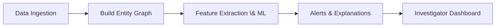
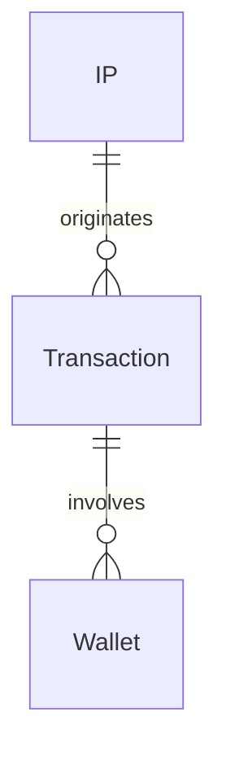

# Executive Summary  
We’re building an **AI-powered investigative system** that links Bitcoin blockchain data with network metadata to flag suspicious transactions. In simple terms: **we ingest data**, build a **graph of IPs, transactions, and wallets**, use machine learning to **spot anomalies**, and produce **ranked alerts** with human-friendly explanations. Think of it as a money-trail detective: it reads the records (CSV files), draws the network of people and transfers, and highlights strange behavior so investigators know *which wallets or transactions to check next*. This involves five stages: **data ingestion** → **entity graph construction** → **AI/ML analysis** → **explainable alerts** → **visual dashboard**. 



# 1) Core System Requirements  
**Data Ingestion:** Reading raw data. We take the synthetic dataset (CSV/JSON/XML) of Bitcoin transactions and network logs. In code, we might do:  
```python
import pandas as pd
df = pd.read_csv('bitcoin_data.csv')
```  
This loads columns like `timestamp`, `src_ip`, `dst_ip`, `txid`, `input_addresses[]`, `output_addresses[]`, `amounts`, `fee`, etc. (Fields come from the PS spec). This is like collecting all the evidence files into one place.  

**Entity Graph Construction:** We convert data into a graph of **nodes** (IPs, wallets, transactions) and **edges** (connections between them). For example, when a wallet sends a transaction, we link the wallet node to the transaction node; when the transaction broadcasts from an IP, we link that IP to the transaction. In NetworkX (a Python graph library), you might do:  
```python
import networkx as nx
G = nx.Graph()
G.add_node('WalletA', type='wallet')
G.add_node('Tx123', type='tx')
G.add_edge('WalletA', 'Tx123', role='input')
```  
This is like drawing a map: think of wallets and IPs as cities and transactions as roads connecting them. This graph lets us see how entities are connected across layers.

**AI/ML Analysis:** We use machine learning to detect **anomalies or suspicious patterns**. An unsupervised model (like Isolation Forest) learns normal transaction behavior and flags outliers. For example, if one wallet suddenly has 50 outgoing payments in 2 minutes (unusual density), the model will give it a high anomaly score. In code:  
```python
from sklearn.ensemble import IsolationForest
model = IsolationForest(contamination=0.01, random_state=42)
model.fit(feature_matrix)  # where each row is a transaction or wallet profile
scores = model.decision_function(feature_matrix)
```  
This assigns a “risk” score to each entity without needing pre-labelled fraud examples (since we lack real ground truth).

**Explainable Alerts:** Rather than just “black-box” scores, we must explain *why* something is flagged. We use techniques like SHAP values to show which features drove the anomaly. For example, an alert might say: *“Wallet X: 95% suspicious. Reason: unusually high transaction volume and rapid multi-hop transfers.”* Investigators can see the evidence (e.g. graph paths) behind each alert.

**Dashboard / Visualization:** Finally, we present results in a simple dashboard. This includes a **ranked list of alerts** (with risk scores and reasons) and a **link-analysis graph**. Investigators can click a wallet or transaction to see its neighbors (IPs, connected wallets/transactions) and the reasons it was flagged.  

**Common Pitfalls & Avoidance:** A few traps to watch out for:  
- **Ignoring data quality:** Malformed rows or missing fields can break ingestion. Always validate and clean the CSV.  
- **Over-linking:** In the graph, don’t assume too much. For example, connecting every IP to every transaction without timing checks can create noise. Only link when the timestamp and context match.  
- **ML without explanation:** A model that just outputs “fraud” is not enough. We must integrate explainability (SHAP or rules) from the start.  

| Term             | Definition (simple)                                 | Why it matters                          | Example                                                     |
|------------------|-----------------------------------------------------|-----------------------------------------|-------------------------------------------------------------|
| Data Ingestion   | Reading transaction/network logs into our system    | Foundation: we need the raw data to analyse | `df = pd.read_csv('data.csv')` reads blockchain records     |
| Entity Graph     | Nodes/edges linking IPs, TXIDs, wallets             | Reveals relationships across data layers | IP1 ─┐<br>    │  Transaction T1  <br> WalletA ─┘ links IP to TX to Wallet |
| AI/ML Analysis   | Models to find unusual behavior                     | Detects anomalies not obvious by rule     | An IsolationForest finds that “WalletA sent 100 tx in 1min” is rare |
| Explainable Alerts| Ranked suspicious flags with reasons               | Investigators need reasons, not just scores | “WalletA flagged: high tx count + rapid hops”               |
| Dashboard        | UI to display alerts and graph                      | Lets analysts explore leads visually      | Click on a node to see its connected IPs/txs in a graph      |

# 2) Technical Research Highlights  
**UTXO (Unspent TX Output):** In Bitcoin, funds aren’t tracked by balance but by “coins” called UTXOs. Each UTXO is like a bill or change you get back from a purchase. For example, if you have a 1 BTC UTXO and spend 0.6 BTC, you give the whole 1 BTC and get 0.4 BTC back as a new UTXO (your “change”). *Why it matters:* Because transactions consume UTXOs as inputs and create new UTXOs as outputs, we can use shared inputs as a clue. If a single transaction uses two UTXOs as inputs, those two source addresses likely belong to the same owner (since you sign both).  

**Wallet vs Address:** A *wallet* is software (or an account) that holds private keys; each wallet can create many *addresses*. An **address** is a string where you send/receive Bitcoin. (Think: your wallet is a chest of keys, and each address is like a mailbox it generates.) The address itself carries no name or identity. *Why it matters:* We cluster addresses into “wallets” during analysis. Analysts often say “wallet A sent 1 BTC,” but really it’s “addresses A1 and A2 (managed by same wallet) sent 1 BTC.” We must remember addresses are pseudonymous—many belong to one user.  

**Common-Input Ownership Heuristic:** This is the assumption that *all inputs of a Bitcoin transaction belong to the same entity*. Analogy: if you pay with a stack of bills (two 1-dollar bills), it’s because you personally had both. Similarly, spending multiple UTXOs means the spender controlled them all. This heuristic is the backbone of address clustering. *Why it matters:* We use it to cluster addresses: if Tx T has inputs from addresses A and B, we link A and B into one cluster (one “wallet entity”). This lets us collapse many addresses into a few entities.  

**Wallet Clustering:** Using heuristics (like above) we group addresses into clusters. It’s like inferring a family from shared last names: if two addresses often appear together, we treat them as one “person.” Clustering reveals “entity profiles” instead of bare addresses. *Why it matters:* Investigators want to follow entities, not endless random addresses. Clustering means one alert for a whole cluster of linked addresses, which often correspond to a single criminal or exchange.  

**Network-Layer Correlation (IP/Port/Timestamp):** This means linking blockchain data to network activity. For example, if we see a transaction broadcast from IP X at 10:01:05, and that IP appears in our dataset, we connect IP X to that TX. Think of it like traffic cameras capturing license plates (IPs) as cars (transactions) drive by. *Why it matters:* On its own, a wallet address is anonymous. But if we can tie a wallet to a specific IP (even roughly), we strengthen our confidence. For instance, “WalletA’s tx came from IP 1.2.3.4”. That IP may be an exchange or VPN and gives clues (geo, ASN).  

**Tor/VPN Limitations:** If a user broadcasts via Tor or a VPN, their real IP is hidden. It’s like sending mail through a chain of post offices to obscure the source. In that case, we only see the exit node’s IP. *Why it matters:* We must **lower our confidence** when a flagged wallet has been using Tor/VPN. The IP link could belong to many users. In practice we could halve the alert’s confidence or mark it as “weak” evidence. This avoids overclaiming: *we don’t “know” who it was, only that something looks odd*.  

**Cluster Explosion (Over-Clustering):** A pitfall of heuristics is accidentally merging unrelated wallets into one giant cluster. For example, if a mixer or CoinJoin adds inputs from unrelated users, blind linkage would treat them as one entity. This “cluster explosion” can produce many false leads. *Why it matters:* Errors here ruin our output. To avoid it, we filter out known mixers or require multiple lines of evidence. We can also cross-check clusters: if linking two wallets makes no sense given other data (different behaviors or IPs), we undo it.  

**Anomaly Detection – Isolation Forest:** This ML model finds anomalies without labels. It works by randomly splitting data and seeing which points are “easiest to isolate.” Strange points (anomalies) require fewer splits. In code (scikit-learn):  
```python
from sklearn.ensemble import IsolationForest
model = IsolationForest(contamination=0.05, random_state=0)
model.fit(features)  # features could be [txn_count, total_amount, time_interval, ...]
scores = model.decision_function(features)
```  
*Why it matters:* It spotlights transactions or wallets whose features (amounts, timing, #connections) deviate from the norm. For example, an unusually high fee or rapid send-receive pattern will pop out.  

**DBSCAN Clustering:** Density-based clustering that groups points if they are close in feature space. Unlike k-means, you don’t need to pre-set the number of clusters and it naturally finds “noise.” We use DBSCAN on transaction/wallet behavior vectors (e.g. patterns of usage). Think of spotting clumps of similar fish in the ocean. *Why it matters:* This can discover coordinated groups (e.g. a botnet of addresses behaving similarly) without direct transaction links. Wallets with similar anomaly scores or network patterns might be flagged together.  

**SHAP (SHapley Additive exPlanations):** A way to explain any model’s output by fairly attributing contribution of each feature. The idea comes from game theory: each feature is a “player” that gets credit for the model’s decision. In practice, SHAP tells us exactly what drove the risk score. Example: “Amount=1000” might contribute +0.4 to the risk, “TimeDiff=5s” adds +0.3, etc., summing to the final prediction. In code:  
```python
import shap
explainer = shap.Explainer(model, background_data)
shap_values = explainer(feature_row)
```  
*Why it matters:* It gives a **human-readable reason** for each alert. Instead of a black-box 87%, we can say “flagged because transaction amount (0.5 BTC) is unusually high and wallet had 5 quick hops” with actual numbers. This transparency is crucial in investigations.  

**Common Pitfalls & Avoidance (Research Stage):**  
- **Mixing Heuristics:** CoinJoin and mixers break simple assumptions. Always check if a transaction is a known CoinJoin before linking inputs as same owner.  
- **Ignoring Port/Timestamp:** Simply matching IP can create false links if timestamps don’t align. Always use the timestamp to correlate network events to blockchain events.  
- **Overconfidence in Clusters:** As Chainalysis warns, one wrong cluster assignment can contaminate many cases. We must treat clusters as leads, not proof.  
- **Black-Box Alerts:** Without SHAP or rule-based reasons, alerts are useless. Plan for explainability from the start.

| Term                    | Definition (simple)                                      | Why it matters                                 | Example                                                     |
|-------------------------|----------------------------------------------------------|-----------------------------------------------|-------------------------------------------------------------|
| UTXO                    | “Unspent change” left after a Bitcoin payment       | Inputs come from UTXOs, so shared inputs link owners | Spending two UTXOs from A and B in one tx implies A=B owner |
| Address vs Wallet       | Address = destination string; Wallet = key-holder container | Many addresses can be one wallet (user)      | A wallet might generate addresses A1, A2; both controlled by one user |
| Common-input Ownership  | Heuristic: all inputs of a TX likely share one owner   | Basis for linking addresses into clusters     | Tx uses UTXOs from Addr1 and Addr2; we assume one owner      |
| Wallet Clustering       | Grouping addresses using heuristics                             | Turns many addresses into one entity         | Clustering A1, A2, A3 as “Entity X” from shared transactions |
| Network Correlation     | Linking IP/port logs to blockchain events (by time)           | Adds context (location/ISP) to addresses    | IP 1.2.3.4 at 10:01:05 matches broadcast of Tx T1               |
| Tor/VPN                 | Tools hiding true IP address                                  | Must reduce confidence of IP links | All transactions appear from Tor exit, so origin is hidden    |
| Cluster Explosion       | Over-zealous clustering linking unrelated wallets            | Leads to false positives                     | A mixer TX incorrectly merges many users’ addresses         |
| Isolation Forest        | Unsupervised anomaly detector                  | Flags unusual transactions/wallets           | Finds a transaction with very high fee as an outlier        |
| DBSCAN                  | Density-based clustering                       | Finds groups of similar-behaving wallets     | Groups wallets that all sent 0.01 BTC every 5 minutes       |
| SHAP                    | Explain ML predictions via feature contributions   | Explains *why* a flag was raised             | “High amount (+0.4) and 10 quick hops (+0.5) sum to 0.9 risk” |

# 3) Implementation Progress  
**Synthetic Dataset:** We’ll create our own “fake” Bitcoin data with realistic fields. Include columns: `timestamp, src_ip, dst_ip, src_port, dst_port, txid, input_addresses[], output_addresses[], input_amounts[], output_amounts[], fee, country, ASN`, etc. Start simple (e.g. 500 transactions) and then weave in suspicious patterns: e.g. a rapid “peel chain” (A→B→C→D quickly), or a mixing cluster. Example code:  
```python
import pandas as pd
from datetime import datetime, timedelta
data = []
now = datetime.now()
for i in range(1000):
    ts = now + timedelta(seconds=i*10)  # one tx every 10s
    data.append({
        'timestamp': ts,
        'src_ip': f"192.168.0.{i%50}",
        'txid': f"tx{i}",
        'input_addresses': [f"addrA{i%10}", f"addrB{i%20}"],
        'output_addresses': [f"addrC{i}", f"addrChange{i}"],
        'input_amounts': [0.5, 0.3],
        'output_amounts': [0.7, 0.099],
        'fee': 0.001
    })
df = pd.DataFrame(data)
```  
*Why it matters:* With synthetic data we control the “plots” – we can test if our AI catches them. For instance, deliberately make 5 wallets transfer money in a loop or quickly split funds. 

**NetworkX Graph:** We build a graph (`nx.Graph()`) where **nodes** have types (`ip`, `tx`, `wallet`) and **edges** represent relations. Example construction:  
```python
G = nx.Graph()
# Add a transaction and its wallets
G.add_node("Tx1", type="tx")
G.add_edge("WalletA", "Tx1", role="sent")
G.add_edge("Tx1", "WalletB", role="received")
# Add IP relation
G.add_node("1.2.3.4", type="ip")
G.add_edge("1.2.3.4", "Tx1", role="broadcast")
```  
This creates a structure: IP → TX → Wallets. (Below is a simplified diagram.)  



**Clustering Steps:** After building the raw graph, we cluster wallets using the common-input heuristic (Union-Find or repeated edge linking). Pseudocode:  
```python
UF = {}
for tx in transactions:
    inputs = tx['input_addresses']
    if len(inputs)>1:
        base = inputs[0]
        for addr in inputs[1:]:
            union(UF, base, addr)  # group them
```
In practice, we can maintain a mapping `address→cluster_id`. This merges wallets sharing inputs into one cluster ID. We then assign each node a cluster label. This is equivalent to “contracting” them in the graph. 

**Cross-Layer Correlation:** We match transactions to network events by time/IP. For each record in the network log, find the blockchain tx with the same timestamp (within a tolerance). Then connect that IP node to the TX node. If multiple IPs appear for one TX (unlikely), or one IP for many TX (common for exchanges), we note it but lower confidence. Example code:  
```python
for _, row in network_df.iterrows():
    tx = find_tx_at_time(row.timestamp)
    if tx:
        G.add_edge(row.src_ip, tx, role='relay')
```
Where `find_tx_at_time` searches our tx DataFrame by timestamp. 

**Handling Shared Infrastructure/Tor:** If many wallets share the same IP (e.g. a Tor exit or mining pool), don’t assign full trust. A simple approach: if an IP is known to be Tor/VPN (from a list or ASN info), then any edge from it carries a low weight or a flag. In scoring, we might multiply the risk by 0.5 for such correlations. In code, maybe:  
```python
if is_tor_ip(ip):
    risk_score *= 0.5  # dampen confidence
```
No citation needed, but this is our policy. It ensures we don’t blindly accuse someone just because they used Tor.

**Common Pitfalls & Avoidance (Implementation):**  
- **Synthetic Bias:** Our fake data might not cover all real quirks. Avoid overfitting to our patterns by varying scenarios (time gaps, random normal behavior).  
- **Graph Complexity:** With many transactions, the graph can get huge. Use filters (e.g., focus on flagged clusters) or efficient data structures.  
- **Clustering Errors:** If the heuristic wrongly merges addresses (see Cluster Explosion), we may inspect edges manually. One fix: remove clusters that become astronomically large or include known unrelated services.  
- **Model Overreaction:** Adjust ML contamination parameter so we don’t flag 90% as anomalies. Also validate that normal test cases aren’t flagged.  

| Term                 | Definition (simple)                                   | Why it matters                          | Example                                                     |
|----------------------|-------------------------------------------------------|-----------------------------------------|-------------------------------------------------------------|
| Synthetic Dataset    | Fake Bitcoin/network records we create for testing    | Allows safe development and repeatable tests | A CSV with timestamps, IPs, TXIDs, amounts, etc.            |
| NetworkX Graph       | Graph library to connect nodes (IPs, TX, Wallets)    | Visualizes and queries relationships    | `G = nx.Graph(); G.add_edge("IP1","Tx1")` connects IP to TX  |
| Cluster (Union-Find) | Data structure merging addresses by heuristic        | Implements common-input grouping        | Union("A","B") means treat A and B as one entity             |
| Cross-layer Linking  | Matching IP logs to blockchain by time/IP            | Correlates off-chain and on-chain data  | Link IP 5.6.7.8 to Tx123 if timestamps match                |
| Tor/VPN Handling     | Detect if IP is anonymized (via known lists/ASN)     | Lowers trust in IP => wallet link      | If IP is in Tor exit list, mark evidence as low-confidence |

# Action Checklist for 2-Day MVP  
1. **Generate or ingest synthetic data** with all required fields (timestamps, IPs, TXIDs, wallets, amounts, etc.). Ensure some transactions form obvious suspicious patterns (multi-hop transfers, rapid bursts).  
2. **Parse data into Pandas** (e.g. `pd.read_csv`) and clean it (fill missing values, correct formats). Confirm all fields from the PS spec are present.  
3. **Build the entity graph** using NetworkX: add nodes for each unique IP, transaction, and wallet; add edges for “IP→TX” and “TX→Wallet” relationships. Label edges with roles (input/output/broadcast).  
4. **Cluster wallets by common-input**: for each transaction with multiple inputs, union those input addresses as one cluster. Assign cluster IDs to wallets and collapse nodes accordingly (or tag nodes).  
5. **Extract features** for each entity (wallet or transaction), such as: total TX count, total volume, average time between TXs, number of distinct IPs, etc. Create a feature matrix.  
6. **Run IsolationForest** on these features to score anomalies. Rank entities by anomaly score. Set a contamination rate so only a few top outliers appear.  
7. **Explain flags**: Use SHAP or simple rules to generate an explanation string for each high-scoring entity. E.g., “High volume and many fast hops” – you can even use simple thresholds for a quick MVP.  
8. **Build a simple dashboard/visualisation** (e.g. Streamlit or Dash) listing flagged wallets/tx with score & reason. Include a network graph view (e.g. via PyVis or Graphviz) that shows the clicked entity in context (neighbors, IPs).  
9. **Review and iterate**: Check the leads list for false positives/negatives. Adjust features or thresholds. Add basic handling for shared IPs (e.g. cut score if IP is TOR).  
10. **Prepare explanation**: Document what each alert means and how our system works, based on the above research, for the team and judges.

**Hinglish Summary:** Is project ka maksat hai Bitcoin ke transactions aur network data ko ek saath analyse karna, taaki hum suspicious wallets ya transactions ko identify kar saken. Yahan hum data ko pahle **ingest (load)** karenge, phir **IP, transactions aur wallets ka graph** banayenge. Uske baad **AI/ML** models se unusual patterns dhundhenge aur har flag ko ek reason ke saath dikhayenge. Finally, ek **dashboard** par dikhayenge ki kaunse wallets risky hain aur kyun. Basically, **AI detective** ki tarah kaam karta hai jo Bitcoin ke money trail ko follow karke batata hai ki kahan kuch gadbad lag rahi hai.